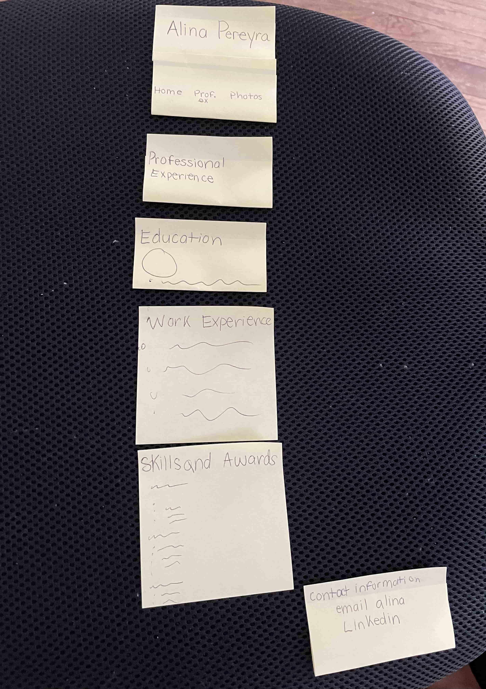

# Project 1: Design Journey

**For each milestone, complete only the sections that are labeled with that milestone.**

Be clear and concise in your writing. Bullets points are encouraged.

**Everything, including images, must be visible in Markdown Preview.** If it's not visible in Markdown Preview, then we won't grade it. We won't give you partial credit either. This is your warning.

## Audience & Content

**Make the case for your decisions using concepts from class, as well as other design principles, theories, examples, and cases from outside of class.**

You can use bullet points and lists, or full paragraphs, or a combo, whichever is appropriate. The writing should be solid draft quality but doesn't have to be fancy.

**No sketches are required for Milestone 1.**

### Website Topic (Milestone 1)
> Briefly explain what your website will be about.

My website will be an interactive about me site that will allow visitors to
read more about my education, professional experience, current projects/hobbies,
and aspirations. Viewers will learn more about my educational background and
internship experiences in detail through the photos, descriptions, and diagrams
provided. What makes this website a more detailed record of my life experiences
than a resume is that it will include progress on my projects and a reflection
section about what I have learned from each of these projects.

### Audience (Milestone 1)
> Briefly explain who the intended audience(s) is for your website. Be specific and justify why this audience is appropriate for your site's topic.

The intended audience for my website includes future employers interested in
hiring me based on my web design experience. Friends and family who want to
learn more about my professional experience and personal interests can also use
this website. This is an appropriate audience for my website because people who
are looking to understand my background in more detail than what a one-page
resume provides will want to visit this convenient website.

### Final Content (Milestone 1)
> Briefly describe the content you plan to include in the final site, and why it's the right content for your audiences.

I plan to include an about me page which will include a photo of me and a list
of my hobbies and contact information linked to this page. This is the right
content for my audiences because it achieves the goal of them learning about my
personal interests. Also, these features are the personal elements that an
employer would normally be missing from a resume or cover letter. Also, my
final site will include a record of my previous professional experience,
long-term goals, and short-term goals.

### Home Page Content (Milestone 1)
> Briefly identify what content you will include on the homepage and why this content should be the first thing your target audience sees when they visit your site.

The homepage will include my name as the heading with a photo of myself. Below
these titles, there will be a short about me section, an inspirational quote,
my goals, and contact information. It will also include another visual that
isn't a photo of me to make the content more aesthetically pleasing.

## Information Architecture

**Make the case for your decisions using concepts from class, as well as other design principles, theories, examples, and cases from outside of class.**

Each section is probably around 1 reasonably sized paragraph (2-4 sentences).

**No sketches are required for Milestone 2.**

### Audience (Milestone 2)
> A clearer description of audience: who are they, what are they interested in with respect to this site, and what are the design goals for that audience.

The main audience members of this personal website are future employers in the
technology industry who are looking to learn more about me beyond my resume.
With respect to this site my goals are to keep the design very clear and
professional. These future employers want to see the creative side of my
personality, so they will be looking for unique aspects of my personal website.
My website design should really showcase my design skills and ability to create
a comprehensive theme.

### Organization & Navigation (Milestone 2)
> A description of how you generated and considered alternatives for the site's content organization and navigation. You are required to include images here of your card sorting for determining the organization of content and the navigation.
<!-- Homepage card sorting trials/alternatives -->
<!-- Source: (original work) Alina Pereyra-->

<!-- Source: (original work) Alina Pereyra-->

<!-- Source: (original work) Alina Pereyra-->

<!-- Source: (original work) Alina Pereyra-->

<!-- Professional experience page card sorting trials/alternatives -->
<!-- Source: (original work) Alina Pereyra-->

<!-- Source: (original work) Alina Pereyra-->

<!-- Source: (original work) Alina Pereyra-->

<!-- Source: (original work) Alina Pereyra-->

<!-- Photo page card sorting trials/alternatives -->
<!-- Source: (original work) Alina Pereyra-->

<!-- Source: (original work) Alina Pereyra-->

<!-- Source: (original work) Alina Pereyra-->

> Thoroughly document this process. The _process_ is the important part of this assignment, not the final result.]

After I considered the organization of my site's content and navigation, I am
still deciding whether or not I need an entire "about me" when I already have an
about me section on the homepage so I decided to leave that part out for now. I
also experimented with the layout of the photo pages with and without the
"Contact Information" element because I was not sure if it was redundent to
include this on all of the website pages. Additionally, I wasn't sure if the
professional experience page also needed a title with my name on it. However,
at the end I decided to include these aspects on their respective pages because
I considered the needs of my target audiences and thought including these
elements in the grouping and areas that I did, makes them the most accessible
and easy to navigate through the website.

The home page formatting took me a while to decide on as documented above. I was
not sure how to place the images and the about me section in a way that wasn't
too distracting. I switched around the placement of the text and images quite
a few times and when I finally decided on the final formatting of including
my portait beside the about me section and a photo beside the quote, I
experienced many error messages in my code.

My process of sorting through the professional experience page mostly consisted
of working with different text alignments. I wanted this page to be viewed as
resume formatting, however, I had many trials of either centering the titles
and body content or keeping parts of this content left-aligned. I also changed
the margin and padding spacing a few times to decide on the best-fit spacing.

The process of sorting through my photo page mostly consisted of me deciding
how many rows or columns that I wanted. At first I included two rows, but after
getting an outside perspective look at the layout, I realized that this
formatting was a lot for the audience to look at one time. I decided on using
two columns and three rows so that this page could be more engaging and
interactive for the intended audience.

### Final Organization and Navigation (Milestone 2)
> Explain how the final organization of content and navigation is appropriate for your target audiences.

The target audience of future employers will be looking to learn more
information about me and if they are interested they might want to contact me
about future employment. Therefore, I included the contact information links
at the bottom of each page. Additionally, I wanted elements such as the
navigation bar, my name, and headings to be the biggest attention grabbers of
each page. I took a lot of time to think about the groups that I created and
the experience that my target audience might have due to these groups, I wanted
to make sure that the groupings were understandable that way I will not confuse
my future website users.

## Visual Design

**Make the case for your decisions using concepts from class, as well as other design principles, theories, examples, and cases from outside of class.**

Remember to focus on the things we can't see just by looking at the site: changes, alternatives considered, processes, and justifications.

Each section is probably around 1 reasonably sized paragraph (2-4 sentences).

### Theme Ideas (Milestone 3)
> Discuss several ideas about styling your site's theme. Explain why the theme ideas are appropriate for your target audiences. Feel free to include some hand-drawn sketches (not digital drawings, not mock-ups, not wireframes, etc.) here to document your design process.

The first thing that I thought of when considering the theme of my website was
that I want it to be clear, easy to navigate, and professional. Therefore, I
am thinking of either using a neutral color scheme or a combination of neutral
colors and one color that stands out. After testing out various
font families, I am leaning towards using either serif or sans-serif because I
want the content of my website to be easy to read. I decided to use each of
these font families for my test theme files in order to figure out which I liked
better. At first, I wanted to use a color that pops, but after many trials I
ended up not liking including bright reds, yellows, and blues. They made my
website look too busy and distracting for the auidence. The visual design fits
the needs of my target audience in that the site is enagaging and is layed out
in a way that is easy on their eyes so they do not have to struggle to sift
through the content. My theme ideas are appropriate for a target audience that
is looking to have a visual appealing experience.

### Theme Design (Milestone 3)
> Discuss your theme designs: how did you come to them, what are their strengths and weaknesses, how do they fit your overall design goals and audiences?

> Emotion is a big part of design. What emotions where you thinking about or trying to convey in your designs?
My first theme idea included a neutral color scheme with different
sections and "boxes" spread out in order for the content to be easy to read and
navigate. I used different elements such as capitalizing certain headings in
order to emphasize the importance of them. The emotions that I was attempting
evoke with this design include trust and tranquility. I want the audience of
potential employers feel as though I am a trustworthy future employee and that
they have a calm, pleasant experience as they navigate through my website.
The first design is very clean and easy on the eyes, and therefore, a bit
stronger than the second. However, a weakness of this design is that the color
scheme is not bright and may come off as a bit dull. For my second
theme, I wanted to try including more color. A strength of this design is that
the large formatting of the images allows viewers to appreciate each one at a
time, and therefore, the content is less distracting. I had trouble with this design
because a lot of the sharp colors make the website too busy. A weakness of the
second theme design is that the color palette is very similar so it makes some
of the text blend together, however, I think it is a strong theme that
emphasizes the sense of professionalism that I intended. This theme evokes the
emotions of being in a natural, open environment. I intended for the audience to
feel joyful and engaged with the vivid color scheme. Overall, both of theses
themes fit my design goals and audience because they show my personality and
create a sense of professionalism and cohesiveness.

## Rationale

**This rationale should be polished writing: one you might submit as a report to a client or boss to help explain the project and convince them you did a good job. You'll be surprised how much writing and communicating you need to do about projects and choices on internships and jobs; practice that here.**

It should be a comprehensive, complete story of the project. You might find that each section runs a few paragraphs (1-2). Sketches can often help tell the story of your design. Screenshots are also useful for describing issues discovered during the design process and how you addressed them.

**All images must be visible in Markdown Preview for credit!**

Your rationale should be a polished version of the earlier explanations.

### Site Layout (Final Submission)
> Show your design process and final layout for your site. You must include photos of your sketches of the layout. No digital drawings permitted.

> You must label each figure and provide an explanation of the sketch.

Sketch for the Home page (version 1). Users can view a photo of me and scroll
down to see an about me section, goals section, and contact information. After
testing this layout a bit, I realized that using a large image was not the most
effective use of space. My audience needs the about me information to be
formatted in a way that shows a correlation to the portrait photo above it.

Sketch for the Home page (version 2). Users can view a photo of me and a short
about me section beside it. The formatting of this information creates clear
sections and grouping of information. Additionally, this formatting proved to
be the most spaced out and clearest version.

Sketch for the professional experience page (version 1). Users can view my
educational background, professional experiences, and skills. The biggest
formatting issues that I faced with this page was deciding how to align my
various elements.

Sketch for the photo page (version 1). Users can view a photo of my family life
and read captions about the names of family members. At first I thought the
most effective use of space was to display the images in a grid-like structure
so that all the images could be seen at once.

Sketch for the photo page (version 2). Users can scroll through my personal
photos and read captions for background information. This proved to be the best
formatting for this design because the element of scrolling through the photos
makes the personal website more interactive.

### Audience (Final Submission)
> A complete and polished description of the intended audience(s) for your website.

The intended audience of this personal website is future employers in the
techology industry who are looking to hire a college student for an internship
or full-time job. The intended audience members will be viewing the personal
website on a desktop device and need the website to be easy to navigate, since
they likely have many applicants to review. This audience will appreciate
elements such as bolded text and clearly distinct sections, so that they can
easily understand my professional background, personal interests, and
persoanlity. Additionally, although the website is meant to showcase my
personality, future employers will appreciate professionalism and a crisp
website look. Images can be an effective method to communicate these goals, but
it is important to note that this audience may be confused by a website that is
too busy.

### Design Goals (Final Submission)
> An explanation of the design goals for that audience, based on your earlier rationales.

Based on my earlier rationales, it is my goal for the audience to understand my
professional interests and artistic vision. I intend for the audience to feel
connected with me after getting to know my core values and ideologies. I want
my audience to understand that the polished code and professional design
exhibited in my website reflects the manner through which I handle projects.
This website will represent my work ethic and commitment to detail that I hope
employers would want me to display if they were to hire me. I want future
employers to have a pleasant and stress-free experience as they explore my page.
That being said, the information layout should not be cluttered and content
should be relevant to future employers. As I was going through my design
process, I realized certain elements that I included in the initial design made
my page redundent and did not fit the needs of my intented audience. For
example, my initial design included a separate about me page that was repetitive
and would not be useful for the target audience.

### Navigation (Final Submission)
> An explanation of how the final navigation met your goals and why its appropriate for your audience(s).

As I explored various trials and layouts for the naviagation elements of my
website, I thought back to my audience's needs. Firstly, the titles of the
navigation links need to be descriptive and obvious links so that finding them
will be effortless. Second, the navigation elements should be clearly formatted
away from general body content so that they do not blend in. Since the overall
theme of my website is a minimalist aesthetic, I did not intent to include
navigation elements that stand out too much or are too distracting from the main
content. In terms of formatting, I tested out laying out my navigation bar
elements vertically in columns, including bullet points to distinguish them,
and using bold, diverse fonts. Further, I decided on including a spaced out
version of a navigation bar with capital letters and thin lines because these
aspects match my theme the most.

### Organization (Final Submission)
> An explanation of how the final organization met your goals and why its appropriate for your audience(s).

The final organization met the goals of my website firstly because the overall
formatting of the website is catered to an audience who will be using a desktop
device. Additionally, the different color shades, lines, and white space
separate sections in a clean manner. My audience will benefit from the great
amount of spacing that I added throughout the website. Also, including large
photos gives the audience a break from reading information and allows them to
tune into a different aspect of processing information. Throughout this design
process one of the biggest difficulties I faced was deciding on how to format
images. I tested various image size adjustments and alignments on my home page
and photos page. Ultimately, I decided to alternate the image formatting on the
home page and keep the size of both images consistent. On the photo page I
decided to include less columns, more rows, and larger images so that audience
will clearly view the photo gallery and enjoy each of the images.

### Visual Design (Final Submission)
> An explanation of how the final design met your goals and why its appropriate for your audience(s).

The final design met my goals of allowing the audience to understand my life and
interests on a more personal level than what a resume provides. The theme colors
that I choose, along with the visual design, both evoke the emotion of trust and
a sense of community. These emotions are comforting for future employers who
are looking through this website to find a trustworthy and skilled employee. I
intended for my visual design to be minimalistic so that the audience can enjoy
the overall aesthetic, but absorb the content at the same time. Almost all of
the photos I included besides one were personally taken, so the audience can
appreciate my graphic design art and photography as well.

### Self-Reflection (Final Submission)
> What did you learn from this assignment? What are some of your strengths and weaknesses?

This was the first large web design assignment that I have experienced, so it
was most definitely an enriching learning experience. I learned that it is so
necessary to plan and sketch out my ideas before I jump into executing them.
A lack of planning often ended up in many mistakes and resulted in a longer
creation process. Some of my strengths include constructing an aesthetically
pleasing theme, brainstorming creative ideas, and using my problem-solving
skills to resolve errors. On the other hand, some of my weaknesses include
fully understanding my target audience and evoking an emotion based on this
understanding. Overall, I really enjoyed this project and I know that the next
lessons regarding interviewing will allow me to fill the gaps in understanding
my audience.
